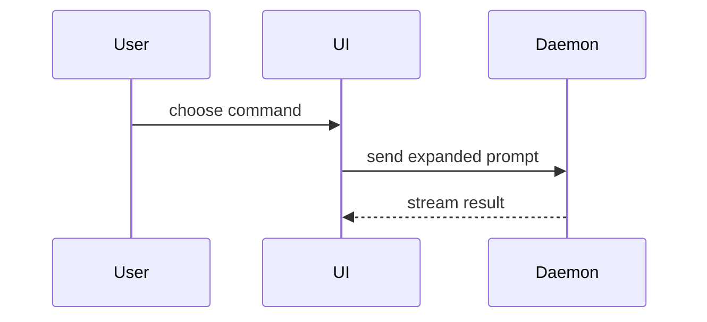

# Visual outline conventions

Pick the smallest view that makes the change clear. Put each view beside the short text it supports. Omit calls, files, props, states, and boundaries that do not help review the pull request.

Show business logic as pseudocode:

```text
on(save)
  if content is unchanged
    return cached result
  write new content
  return fresh result
```

Show runtime control flow as a call tree:

```text
submitForm
  createSession
    persistPrompt
    launchAgent
  navigateToSession
```

Show user-interface structure as a component tree. Include important state, hooks, and package boundaries:

```tsx
<SessionPage> (apps/example/src/routes/session.tsx)
  useSessionEvents()
  <SessionToolbar>
    <RunSkillButton> (packages/ui)
```

Show file responsibility or a broad refactor as a shallow tree:

```text
src/
├── commands/       # parses user actions
├── sessions/       # owns session state
└── transport/      # sends API requests
```

Use Mermaid when sequence or branching is clearer as a diagram:



Use `diff` when the point is how an existing shape changed:

```diff
 <SessionPage>
   useSessionEvents()
   <SessionToolbar>
+    <RunSkillButton />
   <SessionTimeline>
+    <SkillResultCard />
```

```diff
 on(save)
-  write content
+  if content is unchanged
+    return cached result
+  write new content
+  invalidate cache
```

Show the complete target shape when most of it is new, omitted context would hide ownership or order, or a reviewer needs a copyable contract.
